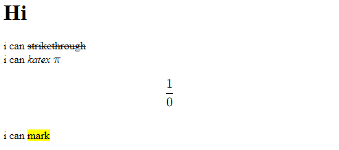

# python-obsidian-like-markdown-renderer
This is a facade for the standard Markdown package for rendering Obsidian Markdown syntax using my extensions.


**Note**: This project was developed as a subproject of my other project, so it does not aim to fully implement Obsidian Markdown syntax.

## How to Cook
Clone this module using
```
git clone --recursive <project url>
```
**Note #2**: This repo contains submodules, so `--recursive` is important.

In `obsidian_markdown.py`, the wrapper for the `__init__` method of markdown.Markdown. To create a markdown.Markdown object, it is enough to call `ObsidianMarkdown`.

```python
from obsidian_markdown import ObsidianMarkdown

md = ObsidianMarkdown()
```

All arguments passed to `ObsidianMarkdown` will be passed unchanged to Markdown. If no arguments are specified, the default values will be used.
If `extension` and `extension_settings` are not specified in the arguments, then standard values will be used to help parse obsidian markdown.

**default extensions**:

official:
- fenced_code
- tables 
- nl2br

unofficial:
- [markdown_mark](https://github.com/alberic89/markdown_mark.git)
- [markdown_obsidian_katex](https://github.com/BlTniki/markdown_obsidian_katex.git)
- [markdown_strikethrough](https://github.com/BlTniki/markdown_obsidian_katex.git)


## Example
Markdown text like
```
# Hi
i can ~~strikethrough~~
i can *katex* $\pi$
$$
\frac{1}{0}
$$
i can ==mark==
```
Will render like:

