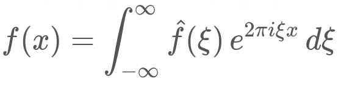

# markdown_obsidian_katex

This is an extension for [Python Markdown](https://python-markdown.github.io/)
which adds [KaTeX](https://katex.org/) support that triggers on `$inline$` katex and `$$` block katex.

```
$$
f(x) = \int_{-\infty}^\infty
\hat f(\xi)\,e^{2 \pi i \xi x}
\,d\xi
$$
```



This project based on [markdown-katex](https://github.com/mbarkhau/markdown-katex) project.
Based on the latest version from July 3, 2023.
All files are taken without any changes, except `extension.py `.
